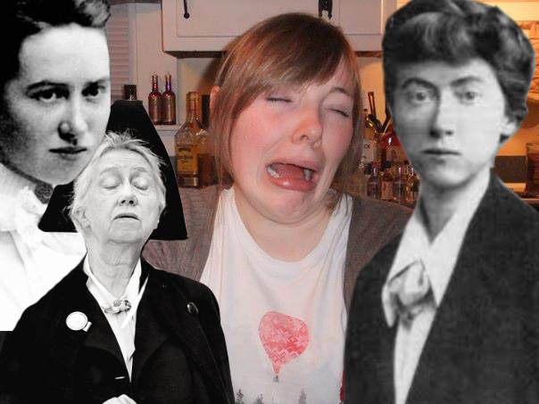
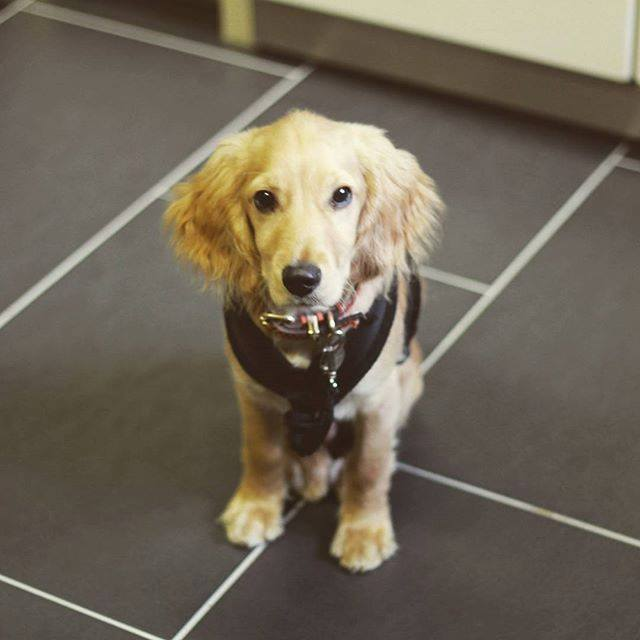

Well, what a jumbled week it’s been. Very nearly decided to can writing a blog since I wasn’t sure I had that much to say, but then the ghost of Marianne Moore haunted me, waving myriad personal essays in my face and I was thusly compelled to take up my keyboard and type for my life.

We got our puppy neutered this week. In all honesty, he’s been a bit of a shit towards us of late. The growly, barky, bitey kind of shit that you really don’t want to be around. You really come to see yourself as ridiculous when you have your head in a dog cage, growling loudly in order to take back a sock from the jaws of a tiny animal that’s baying for your blood. What’s a girl to do? Cut his balls off, apparently. Not sure at this point how much of a difference it’s made.

I’d say about 85% of the time, owning a puppy is as joyful as everyone is led to believe. In the morning, for example, seeing your tiny puppy’s face pop up at the side of the bed, tail a-wagging and more excited to see you than your mother ever has been, that’s really great. When you hold out your hand to him and he puts his little paw in your palm? Yes, you feel your heart break because you know you’ll never be that cute. But when your puppy comes to you, seemingly seeking affection, which you duly offer only to be snarled at? Not so hot.

Guys, I know what you’re thinking. I’d like to point out that we haven’t just allowed him rule the roost. Our vet told us golden-coloured cocker spaniels can be temperamental and aggressive (Chumbo is a cockapoo, but may as well be a spaniel – see picture). She advised us to keep him off the furniture, serve our meals first and speak to him the way we would if he was a naughty toddler.

So we are trying super hard to assert dominance. Remember? Me? Head in a cage? Growling? It’s hard for two completely non-aggressive wimps to have to morph into alpha-males in order to control a puppy who thinks he’s in charge. But like I said, we’re trying. Chumbo is now on a strict schedule of short walks followed by play and training sessions with plenty of sleep and alone time thrown in. If he so much as curls his lip at us these days, we use our newly acquired “tough” voices, all privileges are swiftly whipped away and he’s in time out until he calms down.

I’d also like to point out, he is NOT like this with other people. We’ve had friends look after him who say he’s the best behaved dog they’ve encountered. So maybe he just gets bored of our company. Or he’s turning into a teenager. Or he knows we’re his pack and he wants to be the leader, which is almost endearing considering how much larger we in comparison. Almost.

Basically what I think I’m trying to say is, he’s certainly no Cujo, but we’ve been slightly taken aback by these instances of bad attitude. I thought that by 5 months he’d be speaking fluent English and able to tell us exactly what he requires, but nay. Instead, it seems we’ve had to learn to speak dog. Might be useful for my research; I’ll keep you posted. (Any suggestions, are, of course, very welcome!)

Besides dog days, here’s a rundown of my week:
- **PhD Stuff**
Investigations into taxidermy. Not a big fan of the practice, but it’s extremely interesting to read about and has led to a number of new ideas. Also started reading Debra Hassig’s *Medieval Bestiaries*. V. interesting so far, hopefully more on this next week.
- **Poetry**
Started 1 new poem and tweaked a couple of older ones. Finally bought stamps. Two envelopes now in transit.
- **Comedy**
Episode 2 of the Great British Bitch off available [here](https://soundcloud.com/me3comedy/great-british-bitch-off-with-me3-comedy-episode-2-biscotti). Episode 2 of the Disney podcast is still being edited – small technical disaster has delayed its release. Hang tight, folks, we’ll be right with you.

- **Drawings**
Did [this guy](/forever-starts-and-ends-here/) and have another one I’m finishing up.

- **Exercise**
Swimming buddy is currently knee deep in the Fringe. Could have gone myself but didn’t because I’m scared of facing the world alone. Lots(ish) of walking instead.
- **Puppy**
See above.

(I also want to quickly say I’m dealing with some big life stuff at the moment, which is another story for another time, but if I’ve blown you off or made you feel like I’m ignoring you this week, I’m not, I’m just not really myself right now. Peace pals, peace x)
