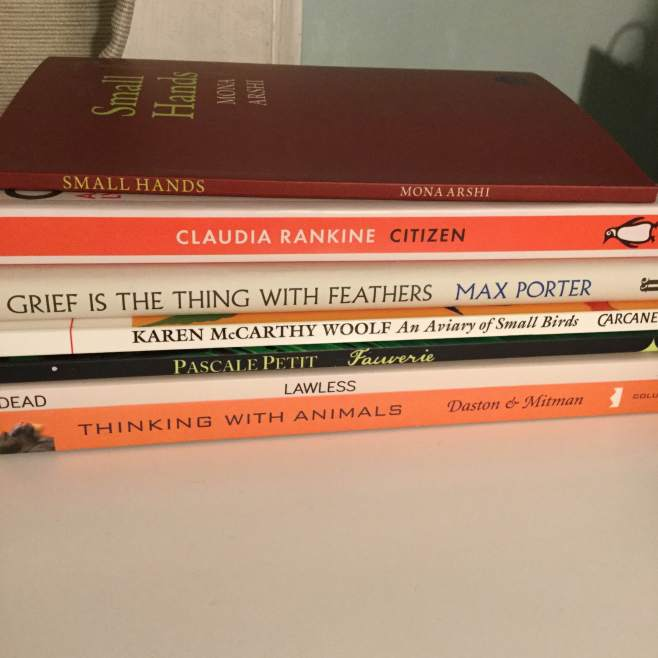
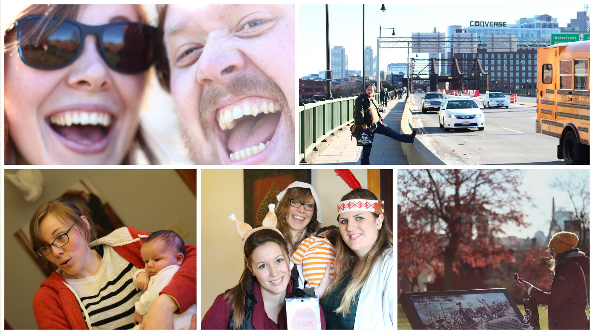
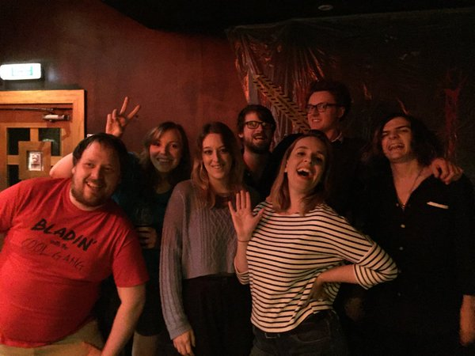

Really struggling to figure out how to open this blog so let’s start with a short hello: hi! How have you been? That’s great. I’m alright as well, just hacking away at my little block, trying to make something meaningful out of it.

SO, PALS! I’m officially “back” after a short break from pretty much everything. In September I decided to take some time away from my PhD; a tough decision that wasn’t made lightly, but has been, I think, for the best. Basically I just wasn’t producing poetry because I was dealing with lots of mad life issues (see [here](/giving-away-juice/) for a very brief insight into that). I decided I was ready to work again in the new year, so properly started second year about a week ago.

Slowly getting back into a normal flow and trying my very best to stick to a rigorous schedule of research + creative writing every day. Completed one whole poem last week, so how’s that for prolific?! (Bear in mind I challenged myself to write 40 poems in 40 days a few years ago and succeeded…a poem a week be slowwwww, man!) I’m also trying to push my research in a slightly different direction now, but I’m not certain enough of it to form coherent sentences…  this space though!

I’m also trying to get back to sending my work to magazines/journals, which I’ve never been the best at because I never feel like anything is good/finished enough for the eyes of others. Aaaaand the swiftness with which everything has been rejected lately only serves to reinforce that, but life is in the trying as no successful person ever said.

I took a break from Facebook because I was spending far too much time worrying about what my life *wasn’t* in comparison with everyone else’s instead of concentrating on what it is, which is not that bad overall. I don’t miss Facebook itself but I do miss out on certain events etc. though I’m undecided on whether or not that bothers me. Hey, what can I say? I’m a massive flake and I never go to anything anyway 🙂

I took a big break from swimming, which I definitely regretted come the new year when all the excellent muscles I’d been honing had shrunk away to nothing and I struggled to do EIGHT lengths, in comparison with the 30 I’d built myself up to previously. Persevering though and up to 20 lengths already, so I can officially tell M People that’s what I’ve done today to make me feel proud.

I took a break from Britain in November and went to Boston to visit one of my besties who just had a divine baby who taught me it’s okay to soil yourself and cry about it. It was also our 10 year friendiversary last year so it was great to be able to actually hang out in person instead of on WhatApp (Boston is just about too far to walk).

 a few wee highlights

Obviously being on holiday meant leaving Chumbo behind, which was SO much harder than I thought it would be! I cuddled him and wept for about an hour the night before we were due to fly. Seeing him again when we got home definitely took the sting out of leaving the US. (Oh yeah, so obviously we kept Chumbo! As you might remember a few months ago [we were having a lot of problems with him](/adventures-in-dog/), but he’s had a major turn around and is basically a dream dog now. More posts about him in the future, I’m sure.)

[Me3 Comedy](https://www.facebook.com/Me3Comedy/) took a break from comedy, although we did perform our very first live gig back in October! It was really good fun and I think people enjoyed it…I certainly laughed on stage when I wasn’t meant to, so I suppose at least one thing must have been funny. Here we are with [Norris & Parker](https://www.facebook.com/norrisandparker/) and [Planet Caramel](https://www.facebook.com/planetcaramel/):

 comedy creatures

We’ll be back to podcasting as of next week and (fingers crossed) will be filming a brand new sketch the following week, which I’m quite excited about.

I think that’s all my breaks so here’s a very quick round up of literally everything else I did in the last three and a half months:

- Re-watched all of Grey’s Anatomy like a total LEGEND (loser)
- Got really into ironing?
- Rediscovered Shrinkles
- Got shortlisted for the Bridport Prize and didn’t win
- Developed a taste for coffee
- Gave up sugar
- Started eating sugar
- Gave up sugar again
- Chilled the flip out

So dat’s it. I was meant to write a blog last week to talk about all my new year’s resolutions, but it’s too late baby now it’s too late, though we really did try to make it, so they’ll just have to stay between me and my conscience.

Peace and love x
