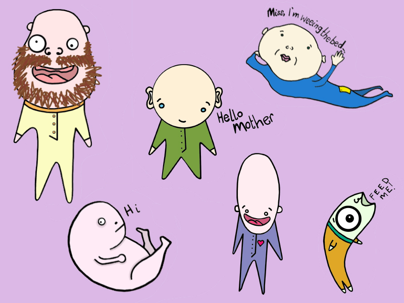
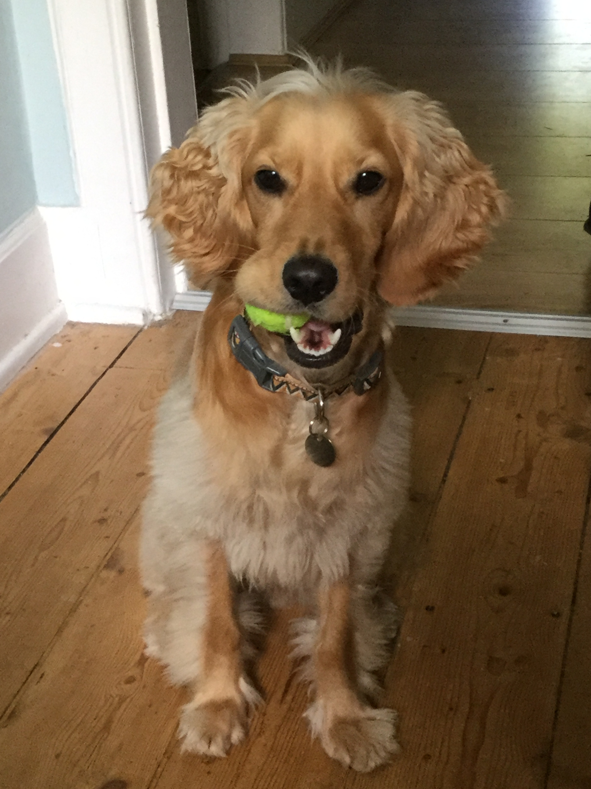

So, anyone else been inordinately broody since the EU referendum results rolled in to ruin our lives? Just me? Weird, I assumed recurring dreams of pregnancy and babies would be totally normal in a time of massive political crisis and uncertainty about the future…

A few baby designs we’re toying with

However, since I’m not planning any babies until I’ve given birth to a completed PhD, we’ll move on. ISN’T THIS EU STUFF A RIGHT BLOODY MESS? Honestly, it was so initially all-consuming I had to ask my beloved to put daytime blocks on all social media and news sites because I was getting n.o.t.h.i.n.g. done. Still got the blocks on and while I don’t advocate burying your head in the sand when it comes to issues as important as these, it has served to calm some of my anxieties and means I can work without feeling the need to trawl Twitter for pro-Tory tweets to get angry with.

But enough of that nonsense. This week I went to see Cats (the musical based on TS Eliot’s Old Possum’s Book of Practical Cats, not just emphatic felines) as part of my “different approaches to research” attempts (and also I bloody love a good musical). Growing up Cats was the show my mum didn’t want to take us to, and that always puzzled me. I knew she didn’t really like cats as animals (like, if one came in the garden she would wing a potato at it with all the speed, but thankfully none of the accuracy, of James Anderson) But now…I understand.

Cats is clearly the product of a cocaine-fuelled weekend at Lloyd-Webber Towers; Andy and Tim (Rice) in lycra reciting children’s poetry to one another then having a serendipitous lightbulb moment when they realise this is the 80s, everyone is just as high as they are and they can definitely net a few mil if they add some lights and a funky beat to the proceedings. And hey, for extra fun, let’s make it three and a half hours long with only a very vague storyline to keep the whole thing plodding along.

Maybe it was because we were boiling hot in the Playhouse, hemmed into the tiny balcony seats and distracted by the fact our legs were slowly dying through lack of movement, but by the time the interval rolled around, we both had to clarify that we hadn’t missed some vital piece of the story that was the key to unlocking this trippy, cat-infested ballet-come-opera. But nay, this really is just TS Eliot’s poems set to music that’s fast enough to convince you you’re having a total blast.

I exaggerate. There IS a worm of a story stringing things together. The Jellicle Cats are having a get together under the Jellicle moon where Old Deuteronomy (read: representative of the patriarchy) will choose a Jellicle cat to be reborn into a new Jellicle life. Oh, and if you don’t know what a Jellicle cat is, go see Cats – I assure you it won’t be long before that’s the ONLY Jellicle thing you know.

Before any sort of rebirthing plans are made, we meet a number of cats, including Grizabella (read: representative of women, particularly older women, in society), a former “glamour cat”…make of that what you will, but I think it’s meant to imply she’s a washed-up porn star/prostitute?? Bear in mind, Grizabella was never part of Eliot’s poetry, but no doubt he’d be totally fine with the misogynistic handling of an older female character. Anyway, Grizabella is the obvious choice to be reborn but, UH OH all the other cats hate her and refuse to go near her. So downtrodden is she that she’s forced to sing the heart-wrenching ballad Memory, a song about Elaine Paige’s rise to fame and fortune and a regular show on BBC Radio 2. Eventually the patriarchy takes pity on her and she flies off into the rafters never to be seen again until the curtain call where she gets the biggest WOO of the night for singing the one song that everybody knows.

What annoyed me the most about this pseudo-storyline was that it was probably Old Deuteronomy who told the other cats to treat her like shit in the first place only to have a change of heart and let her be part of the gang again. THIS MUCH-LAUDED MALE CAT IS A SEXIST BULLY. As are all the other cats. Great sense of pitch and rhythm, but bullies nonetheless. Who are they to judge Grizabella’s glamourous past? Whether they set out to or not, Andrew Lloyd-Webber and Tim Rice have perfectly captured the treatment of older women in society through anthropomorphism (see, I told you it was about my research).

Ugh. I’ve spent so long getting worked up about sexism I haven’t left myself to discuss The Rum Tum Tugger, who, at one point crip walked on stage playing hip hop bagpipes (‘\_’) Or the resonating racism in Growltiger’s Last Stand (despite recent changes to the lyrics), which really ought to be completely rewritten or cut from the show at this point.

I’ve also been quite negative about the show overall, which isn’t entirely fair. It was alright. Like 5/10? There was a 15 minute dance number just before the interval which really threatened to stick the knife in for me, but Scrimbleshanks The Railway Cat managed to save it. To give Cats its due, it’s brought a bunch of kids poems from the 30s to life for a modern audience and doesn’t seem to be going anywhere any time soon, which is pretty cool I suppose. I also want to reiterate, I love musicals, so I’m not just being a Debbie Downer here.

Take home message? Dogs are better than cats:

