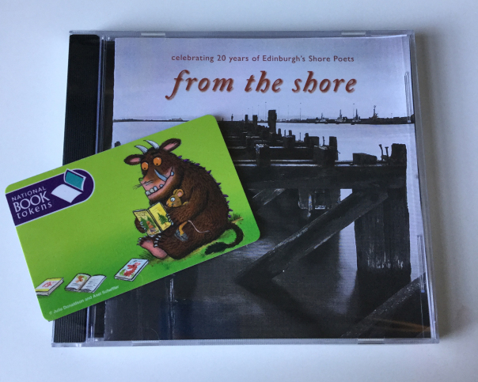
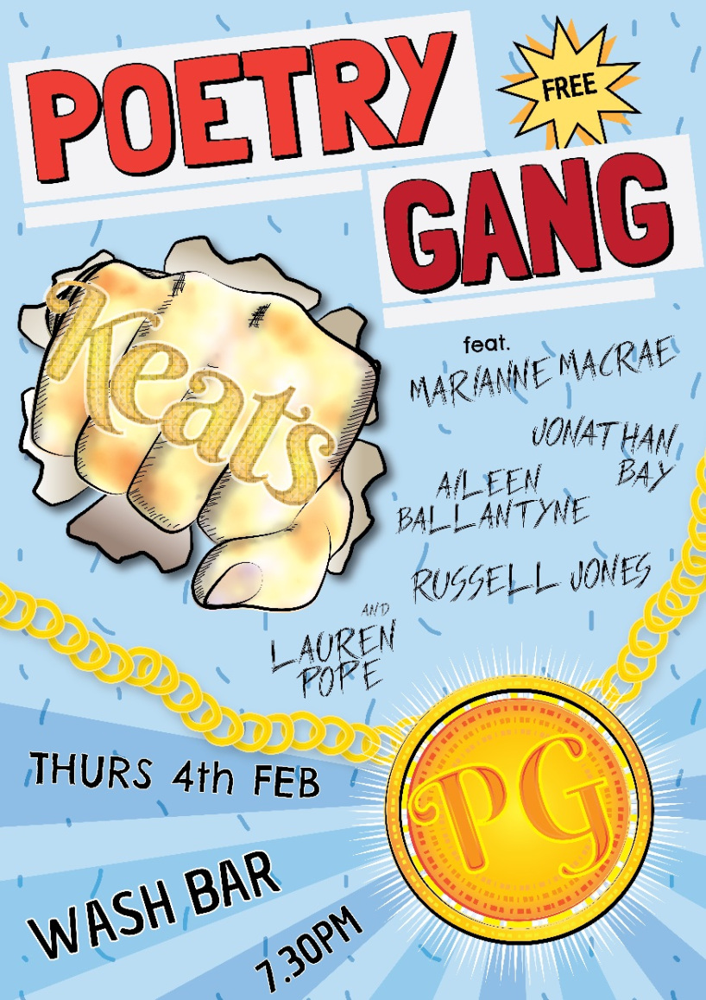

It’s been another alarmingly snappy week over here at Marianne Towers, so much so that I am apt to wonder if someone is playing a trick on me – pretty sure none of the clocks in the flat are correct, at least, none of them show the same time and often I’ll settle down for LITERALLY ONE GAME of Candy Crush and all of a sudden three hours have passed and I’m still not a published poet.

Did I say we bought a sunrise alarm clock? Well, we bought a sunrise alarm clock and it’s actually pretty cool. You set the time you want to wake up, then half an hour before the light comes on and gently brightens as though t’were a crisp spring daybreak and you feel like a little bird ready to wake up and sing. I genuinely didn’t think it would work for me, but it’s been a pleasant surprise to say that it does. I usually wake properly about 15 minutes before the alarm goes (you can have a beeper, just to make sure you get up) and get Chumbo up on the bed for a morning cuddle (we held off for months and months before we let him on the bed and now I can’t imagine why!) So yeah, my advice if you hate getting out of bed in the morning, and let’s face it, literally everyone does and if you say you don’t you’re lying to yourself and to us, then I highly recommend investing.

Saying that, I had a lie-in this morning because I woke up at 4am after I heard a ghost playing marbles in the empty flat upstairs, and then couldn’t get back to sleep for about a hundred years (1 hour). Also I was out last night at the Shore Poets Quiet Slam, where I took 2nd place, yay! My good pal, [Russell Jones](http://poetrusselljones.blogspot.co.uk/) won overall with some top notch poems from his new book The Green Dress Whose Girl is Sleeping (buy it [here](http://www.freightbooks.co.uk/the-green-dress-whose-girl-is-sleeping-by-russell-jones.html) << an imperative). Thanks to Shore Poets for having me along – really enjoyed listening to some fantastic poets and being allowed to get up and read for them in return.

Me and Russell, along with 3 other super duper writers – Lauren Pope, Aileen Ballantyne and Jonathan Bay (we’re collectively and affectionately known as Poetry Gang) – will also be reading at Wash Bar on The Mound this Thursday (4th Feb), so do come along if you’re free! It’ll be really relaxed and fun, and best of all it’s freeeeeee. We’re all Edinburgh University PhD-ers – Aileen and Russell have both graduated into official Doctors and are, I think, running a small GP (General Poetry) practice just outside of Glasgow, while we three others are slogging away in second year.

*reading deets (poster designed by [Richard Hanrahan](https://www.richardhanrahan.co.uk)*

I’ve been doing quite a lot of editing this week, in preparation for said readings/sending things away to magazines because ain’t nobody gonna come knocking on my door with a publishing deal amiright? I’ve mentioned before that I am ridiculously lazy/nervous/picky about putting my work out there and I think it’s because of this editing process. Sometimes I discover old poems that I wrote years ago and filed under “Fucking Dire Never Read Again” and realise they’re not actually that bad after a few tweaks, but most of the time I wind up editing myself into a corner clutching words like “darkness” and “blood” and “eggs” and insisting I can squeeze them into every single poem if I just keep cutting and pasting. It becomes very boring very quickly and I only have myself to blame. I’m really working on an objective point of view for editing but it’s haaaaaard.

I am, however, finding it so useful to workshop pretty much everything I write with Poetry Gang (did I mention we’re doing a reading this week? Click [here](https://www.facebook.com/events/1734610713429122/) for more info). We meet just about every week and share thoughts on one another’s work. Having four voices of reason critiquing my writing in a friendly environment definitely helps to put stuff in perspective – you may have gathered, I can get really surreal really quickly if I’m not kept in check.

Anyway, I’ve spent bloody ages intermittently writing this, singing along to the Les Misérables soundtrack and refreshing my hot water bottle so I should really get back to some actual work. Here’s a round-up of my week:

**Phd:** Still reading *Thinking With Animals* and enjoying it. Need to go get the *Medieval Bestiary* back from the library since it was usurped before Christmas.

**Poetry:** Turns out I hate Shelley, but I really like Emily Dickinson and Christina Rossetti. I think I’m gonna sub Percy out for Tony Harrison and tap into my Yorkshire upbringing. Elsewhere, I wrote TWO sonnets. Well one and a half…but I’m counting it.

**Exercise:** Nice dose of swimmer’s ear means no swimming this week, sad faces all round. Loads of walking and yoga instead though.

**Puppy:** Still super cute and virtually a real dog now, so will probably stop having to call him a puppy. Read something about a dog who died and cried loads and hugged him for about an hour.

**Drawing:** Errrrm, still not back to this yet. But I did start a new painting at the weekend, so that’s fun. Oh also, I know it’s not a drawing, but me and Hitch had a pottery lesson a couple of weeks ago and went back to glaze them. Super fun and shall share pictures eventually.

**Comedy:** Brand new *It Disney Matter* podcast for your listening pleasure! Check it out [here](https://soundcloud.com/me3comedy/it-disney-matter-it-does-with-me3-comedy-episode-3-flubber?utm_content=buffer3bf3d&utm_medium=social&utm_source=plus.google.com&utm_campaign=buffer)

Enough now.
