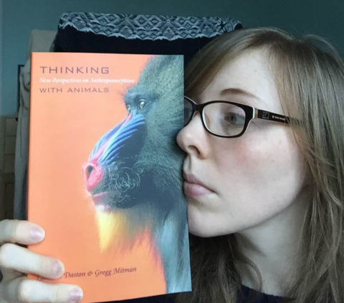
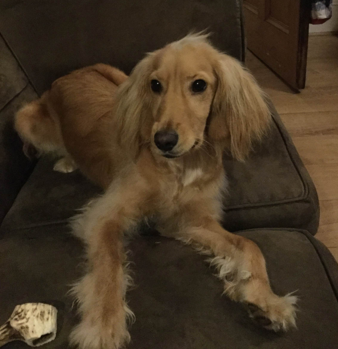

Apparently it’s Monday again already, so time for another blog. As usual, I feel like I haven’t done that much this week, but when I look back through my notes I realise I’ve actually read quite a lot so that’s good!

One of my resolutions this year (yeah, I know I wasn’t going to tell you,
butIMG_0300 it’s relevant now) was to date the pages of my notebook and write down literally any “interesting” thought I might have throughout the day. A sort of pseudo diary, I suppose, because I’m not really recording events as such, just images and musings. So yes, I’m using “pseudo” to mean both “sham” and “pretentious” here…hmm, well done me? Not a particularly novel idea, but I’m finding it quite helpful; I’m certainly getting plenty of creative writing done now anyhow. I’m also toeing the water in terms of research too. Currently reading Daston & Mitman’s *Thinking With Animals*, which is pretty darn relevant/interesting thus far.

Just got back from the library, which was, as always, oven-like in its ability to cook me slowly from the inside out. I picked up the complete works of Shelley, Dickinson and Rossetti. Not my usual bag, but I spoke to my supervisor last week who suggested choosing three poets and ONLY READING THEM FOR A WHOLE MONTH. Initially a year was suggested and we was like whaaaaaat?! But we agreed that that’s an inordinate amount of time to only read three poets, particularly when I have a thesis to write about three entirely different poets. It was also suggested that I might like to read some more “traditional” works, since I’m a postmodern, free verse kinda gal and find the very idea of rhyme and metre utterly nauseating. That’s not necessarily to say I don’t like it when other people do it, I just cannot bear it when I try to do it myself.

So these are the three I pick because…you know, I heard they’re quite good. Right now I find the idea of this task utterly arduous, so I’m throwing in John Ashbery as well otherwise I think I’ll go mad. I’m also listening to James Schuyler’s [Hymn to Life](http://www.poetryfoundation.org/poetrymagazine/poem/21778) LOADS because it’s bloody great and ain’t nobody gon’ stop me!

I’ll keep you posted on how long I last with this. (NB, yeah, I know I probably should have read all of these poets in more detail than I have thus far, but I planted my roots in linguistics, not literature, so gimme a GD break, would ya?)

Burns Nicht today, obvi, so off for some haggis and poetry reading with pals this evening. This time last year I was taking part in the [NLS Burns Night Slam](https://www.eventbrite.co.uk/e/poetry-grand-slam-tickets-19947187575) which is worth popping along to if you’re in Edinburgh and at a loose end – lots of great performers taking part in a welcoming environment. I’m sad I’m not doing it again!

Right, back to the grind. JK I’m gonna eat a piece of toast first, and then get back to it. Here’s a rundown of the rest of my week:

- **Poetry –** two poems finished, one of which needs major work, the other…is okay for now.
- **PhD –** See above, I guess.
- **Exercise –** 25 lengths at the pool and an earful of water, which is making me feel a bit sickish tbh.
- **Drawings –** Pretty much forgot that this was one of the things I was doing…I’ll pick that back up at some point soon, I’m sure.
- **Comedy –** We recorded a podcast yesterday! *It Disney Matter (It Does)* is officially baaaaack! I’ll get a link up at some point, because I know you’re all dying to listen.
- **Puppy –** Got bathed this weekend, looking extremely dapper! Wasn’t going to post a picture of him this week, but he’s just too cute, so I’m sharing:

See you next week, dolls.
