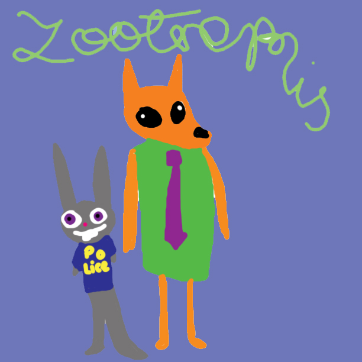
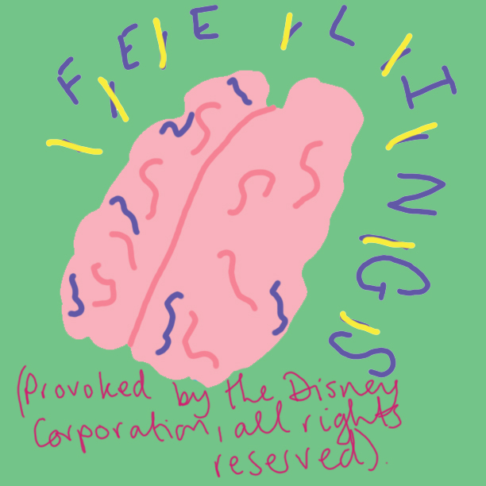
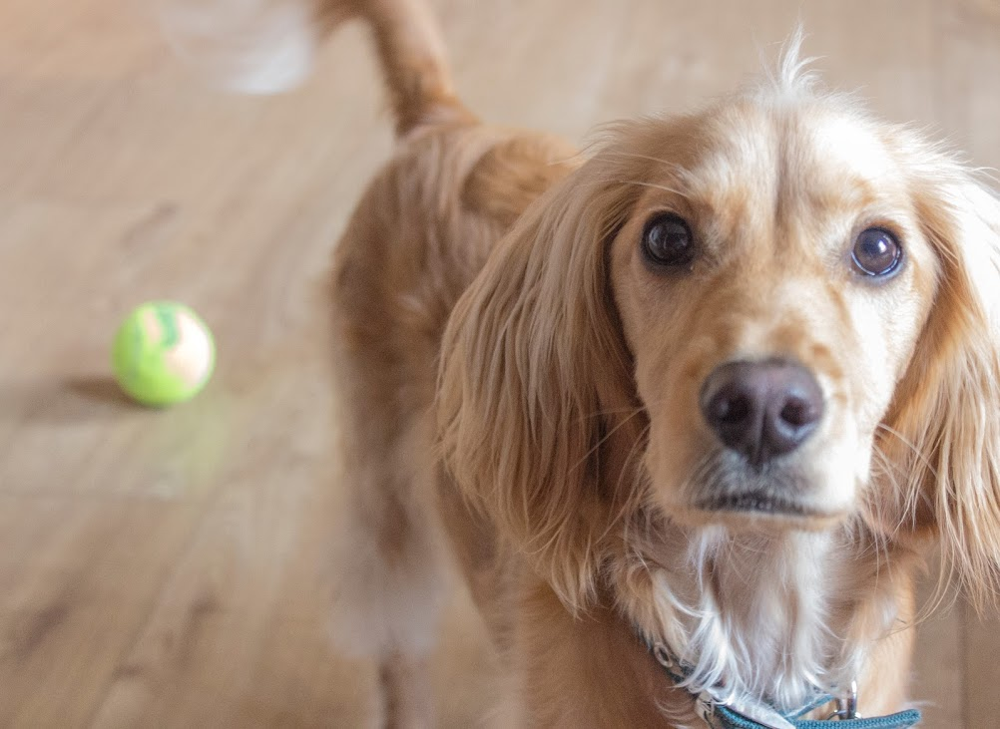

As Popeye might say after a very busy period of work, “Ug ug ug ug ug ug ug! I’ve been so busy lately, it has been really mad”, and I’d like to mirror those sentiments exactly as an explanation for why I haven’t written a blog in so long. I had my second year review deadline a couple of weeks ago and I also (perhaps foolishly, only time will tell) signed up to teach next year so have been doing some prep stuff for that, all the while cracking on with some hot talking animal/poetry research. Earlier in the week I was feeling a bit BLAH about the whole PhD situation, though I’m assured that’s just the general vibe of second year. Anyway, I decided to take some time way from my desk and approach my research from a slightly different angle…

…yesterday I went to see Disney’s latest offering, *Zootropolis*, set in a world where anthropomorphic animals rule with not a human in sight. Guyyyyyyyyys! It was really great. So I figured, since I’m passing this little cinema sojourn off as research I’d better share some of my thoughts on the film in the context of my PhD (for those of you who have forgotten/just don’t know, I’m studying talking animals in poetry). I’m aiming to keep spoilers to an abso minimum, but apologies if there are any – will flag ’em. Also the accompanying pictures are actual stills from the film that Disney sent me because they knew I was writing this blog.

The general story of *Zootropolis* goes: animals have evolved to a point where prey and predators live in complete harmony, within human-type cities, where they drive cars, wear clothes and speak perfect American-English. We follow the story of Judy Hopps, a bunny from the country who wants to be the first rabbit police officer, but LOL bunnies can’t be cops, can they?! (SPOILER) Well, as we see during the course of a handy training school montage, yes. they. can.

So while all the animals pretend that they’re bffs, there’s still some very clear animosity towards foxes, who are characterised as sneaky, treacherous, mean and violent, and apparently, out of all the other predators (including but not limited to, tigers, lions and wolves), are the most likely to break the sacred bond of trust made with prey animals in order to guzzle down a lamb or two. So OF COURSE Juddy Hopps is going to have to befriend a fox in order to succeed in her adventure. Enter Nick P. Wilde, a smooth talking hustler perfectly voiced by Jason Bateman.

This raw deal for foxes seems to hark back to the medieval bestiaries, where foxes are portrayed as devious lad pals of Satan who pretended to be dead in order to lure birds into their mouths – a trope that has been handed down through fables and fairy tales and is still fairly pertinent today. BUT what’s nice about this film is the shattering of these dull illusions to show that foxes ARE a-okay and deserve respect, just like all the other animals. Really, that seems to be the take home message of the whole film – be kind to others and treat everyone the same. GOOD WORK, DISNEY, making us all reevaluate our treatment of any number of political issues including but not limited to race, gender and religion by forcing us to see ourselves in these little animal dudes!

So yeah, I’ve been reading a lot lately about the “sympathetic imagination” and the ways animals can be used to activate this facet to provoke empathy and compassion in humans. I will (poorly) elaborate on this in the following few lines: The fact that there are zero humans in this film is great, because it means the audience has to put themselves in the position of the animal, therefore subconsciously eliciting more respect for animals and their feelings as living beings. At the same time the sympathetic imagination allows us to overlay the message behind the movie onto other aspects of our lives – if we follow Judy Hopps’s example of positive attitude plus helpful demeanor everything will work out in our favour (that’s kind of a spoiler, but this is Disney, I’m sure you saw it coming so no complaints).

Interestingly there were no domestic animals featured in this film, i.e. cats and dogs, and I couldn’t quite figure out why. Maybe because IRL pets (cats and dogs in particks) bridge the gap between humans and animals so we don’t want to see them in predator/prey situations? Or maybe the idea of dogs and cats fending for themselves (without our benevolent intervention) isn’t quite so appealing as a rabbit and a fox getting shit done and makin’ it work?

Anyway, this is now really long and even though I have 2 more pages of notes, I’ll stop. If anyone else has seen this movie and would like to discuss it, I am MORE than willing to go into way too much detail (I had a whole section on the self-referential nature of Disney, but I’ll save that for another day.) Oh also, if you like Disney in general, be sure to check out Me3 Comedy’s podcast *It Disney Matter (It Does)* by clicking [here](https://archive.org/details/2016328005Me3IDMTheTiggerMovie2000) (basically me and my comedy/life partner [Richard Hanrahan](https://www.richardhanrahan.co.uk/) discussing Disney movies with a comedy edge).

Here’s a brief run down of life since last I blogged:

- **Poetry –**  Oh yeah I won a thing! The Grierson Verse Prize…so that was nice and surprising.
- **Drawing –** Bought myself some Posca pens and a black page notebook and have been doing stuff, will post images soon.
* **PhD –** Counted up and already have 40-50 poems, which means only like 30 more to have the amount necessary. Slowly getting back into research too…as I explained above. Currently reading *The Animated Bestiary* by Paul Wells and *The Lives of Animals* by J.M. Coetzee.
* **Puppy –** Chumbo turned 1 in March! He’s so grown up these days and ridiculously well behaved (most of the time). Here he is being undeniably adorable:

Ciao!
